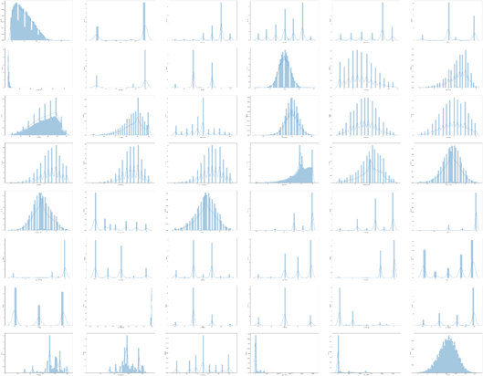

# Covidstress

#### Predicting Psychological Distress under Coronavirus Disease Pandemic)

h3(Dataset)

1. COVIDISTRESS Global survey dataset (Yamada et al., 2021)

Period: 30 March to 30 May 2020

Sampling: online and media appeals

No. of features: 29
 - Demographic variables
 - Emotional responses
 - Attitudes
 - Coping resources

2. Oxford COVID-19 Government Response Tracker (Hale et al., 2021)

Period: since 1st January 2020

Sampling: Rated by OxCGRT by collecting information from governments of different countries

No. of features: 16
 - Cases and deaths statistics
 - Confinement and closing policies
 - Economic policies

  
Exploratory Data Analysis

References
Hale, T., Angrist, N., Goldszmidt, R., Kira, B., Petherick, A., Phillips, T., Webster, S., Cameron-Blake, E., Hallas, L., Majumdar, S., & Tatlow, H. (2021). A global panel database of pandemic policies (Oxford COVID-19 Government Response Tracker). Nat Hum Behaviour, 5(4), 529-538. https://doi.org/10.1038/s41562-021-01079-8 
Yamada, Y., Ćepulić, D. B., Coll-Mart­ín,, T., Debove, S. p., Gautreau, G., Han, H., Rasmussen, J., Tran, T. P., Travaglino, G. A., & Lieberoth, A. (2021). COVIDiSTRESS Global Survey dataset on psychological and behavioural consequences of the COVID-19 outbreak. Scientific Data, 8, 3. https://doi.org/10.1038/s41597-020-00784-9
