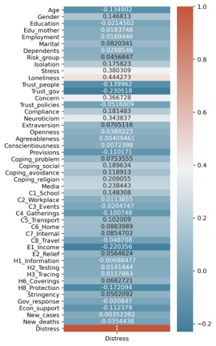
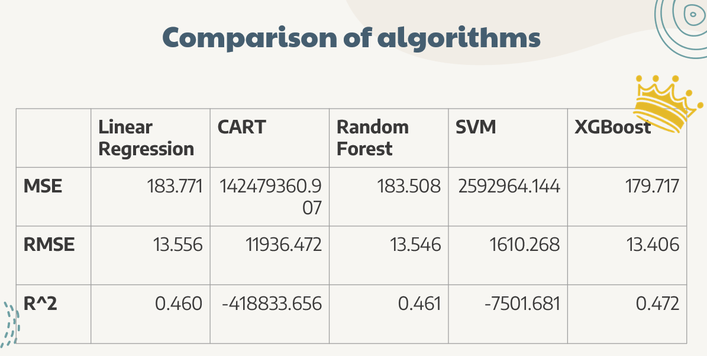
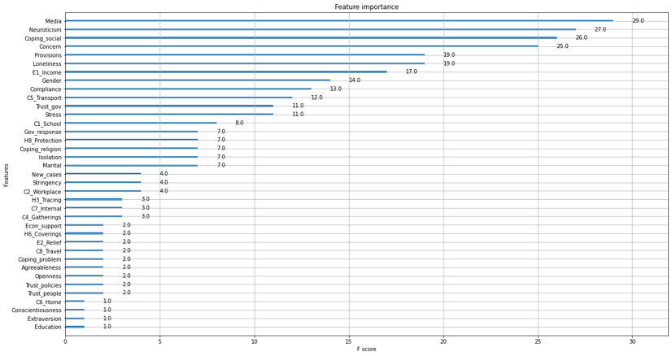

# Predicting Psychological Distress under Coronavirus Disease Pandemic

## Hypotheses
1. Stress and loneliness are the most significant predictors of distress under COVID-19
2. XGBoost has the highest predictive accuracy among the models

## Dataset

### 1. COVIDISTRESS Global survey dataset (Yamada et al., 2021)

https://www.nature.com/articles/s41562-021-01079-8

Period: 30 March to 30 May 2020

Sampling: online and media appeals

No. of features: 29
 - Demographic variables
 - Emotional responses
 - Attitudes
 - Coping resources

### 2. Oxford COVID-19 Government Response Tracker (Hale et al., 2021)

https://www.nature.com/articles/s41597-020-00784-9

Period: since 1st January 2020

Sampling: Rated by OxCGRT by collecting information from governments of different countries

No. of features: 16
 - Cases and deaths statistics
 - Confinement and closing policies
 - Economic policies

### Final dataset 

- 94,901 responses
- 49 features
- 35 Binary flags

## Exploratory Data Analysis

### Distribution

### Colinearity 

## Data Preprocessing 
1. Filtering the period of research
2. Selecting interested features
3. Removing rows and columns > 50% NA
4. Replacing NA by mean
5. Calculating sum of features with more than one question
6. Adding binary flag
7. Filtering matched countries
8. Merging two datasets

## Analytical Procedures
1. Linear Regression
2. Classification And Regression Trees
3. Random Forest
4. Support Vector Machine
5. XGBoost

## Results 
### Comparison of algorithms

### Feature importance - XG boost 

## References

Hale, T., Angrist, N., Goldszmidt, R., Kira, B., Petherick, A., Phillips, T., Webster, S., Cameron-Blake, E., Hallas, L., Majumdar, S., & Tatlow, H. (2021). A global panel database of pandemic policies (Oxford COVID-19 Government Response Tracker). Nat Hum Behaviour, 5(4), 529-538. https://doi.org/10.1038/s41562-021-01079-8 

Yamada, Y., Ćepulić, D. B., Coll-Mart­ín,, T., Debove, S. p., Gautreau, G., Han, H., Rasmussen, J., Tran, T. P., Travaglino, G. A., & Lieberoth, A. (2021). COVIDiSTRESS Global Survey dataset on psychological and behavioural consequences of the COVID-19 outbreak. Scientific Data, 8, 3. https://doi.org/10.1038/s41597-020-00784-9
